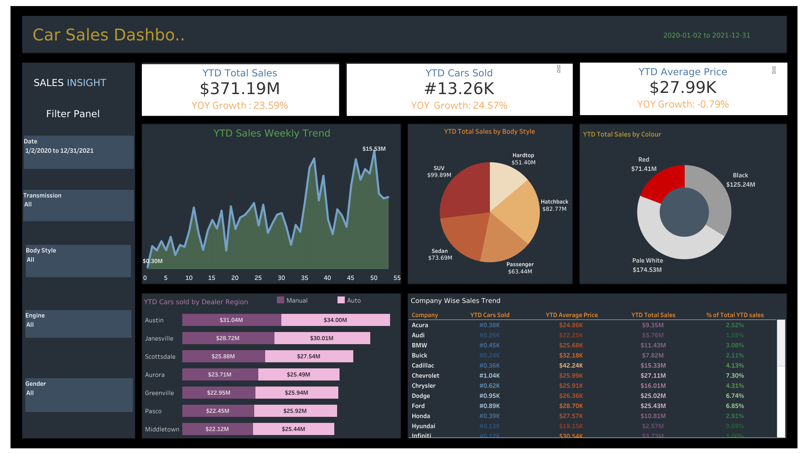

# 🚗 Car Sales Dashboard (Tableau)

This project presents an interactive dashboard built using **Tableau** to analyze car sales data for a dealership. The goal is to track key sales performance metrics and provide actionable insights to support strategic decision-making.

---

## 🎯 Objective

Design and develop a dynamic **Car Sales Dashboard** that visualizes key performance indicators (KPIs), identifies trends, and highlights the most popular car attributes to help the dealership optimize its sales strategy.

---

## 📊 Tools & Technologies

- **Tool:** Tableau
- **Data Source:** CSV file (mock dealership data)
- **Skills Used:** Data Cleaning, Dashboard Design, KPI Analysis

---

## 🔍 Key Insights

- 📈 **Sales Growth:** 23.5% year-over-year increase.
- 🚙 **Top-Selling Body Style:** SUV contributed the highest to total sales.
- 🎨 **Most Popular Car Color:** Pale White was the most purchased color by customers.

---

## 🌐 View Dashboard Online

👉 [**View the Interactive Tableau Dashboard**](https://public.tableau.com/app/profile/sameera.tanveer/viz/CarSalesDashboard--Project1Project-basedLearning/Dashboard1)

---

